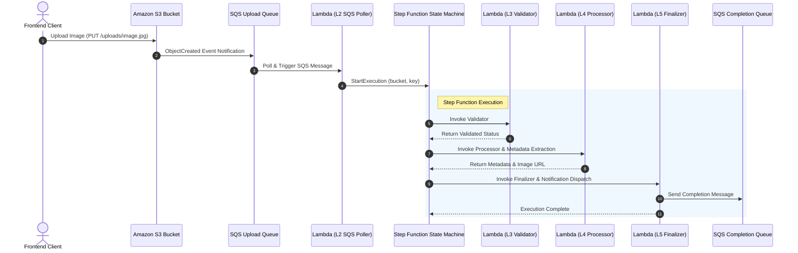

# Architecture & Sequence Flowchart

```mermaid
sequenceDiagram
    autonumber
    actor User as Frontend Client
    participant S3 as Amazon S3 Bucket
    participant SQS1 as SQS Upload Queue
    participant L2 as Lambda (L2 SQS Poller)
    participant SFN as Step Function State Machine
    participant L3 as Lambda (L3 Validator)
    participant L4 as Lambda (L4 Processor)
    participant L5 as Lambda (L5 Finalizer)
    participant SQS2 as SQS Completion Queue

    User->>S3: Upload Image (PUT /uploads/image.jpg)
    S3->>SQS1: ObjectCreated Event Notification
    SQS1->>L2: Poll & Trigger SQS Message
    L2->>SFN: StartExecution (bucket, key)
    
    rect rgb(240, 248, 255)
        Note right of SFN: Step Function Execution
        SFN->>L3: Invoke Validator
        L3-->>SFN: Return Validated Status
        SFN->>L4: Invoke Processor & Metadata Extraction
        L4-->>SFN: Return Metadata & Image URL
        SFN->>L5: Invoke Finalizer & Notification Dispatch
        L5->>SQS2: Send Completion Message
        L5-->>SFN: Execution Complete
    end
```